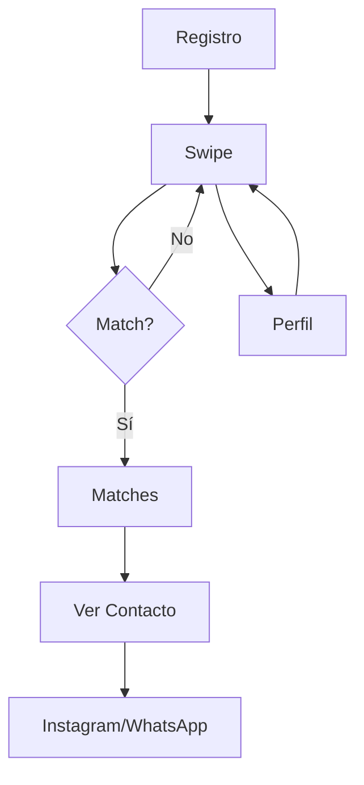

## 1. Product Overview
Aplicación de match social sin chat integrado. Los usuarios hacen swipe y cuando hay match mutuo, se revelan enlaces de contacto externo (Instagram y WhatsApp) para conectar fuera de la app.

- Problema: Muchas apps de dating tienen chat interno que genera fricción y abandono
- Solución: Eliminar chat interno, facilitar conexión directa en redes sociales
- Público: Jóvenes adultos que prefieren conectar por Instagram/WhatsApp directamente

## 2. Core Features

### 2.1 User Roles
| Role | Registration Method | Core Permissions |
|------|---------------------|------------------|
| User | Email + Instagram link required | Swipe profiles, view matches, share contact links |

### 2.2 Feature Module
La app consta de las siguientes páginas principales:
1. **Registro**: formulario con datos básicos, link Instagram obligatorio, WhatsApp opcional
2. **Swipe**: interfaz de swipe con perfiles, like/dislike
3. **Matches**: lista de matches mutuos con enlaces a Instagram y botón WhatsApp
4. **Perfil**: edición de datos y preferencias

### 2.3 Page Details
| Page Name | Module Name | Feature description |
|-----------|-------------|---------------------|
| Registro | Formulario de alta | Solicitar nombre, edad, género, preferencias, foto de perfil, link Instagram (obligatorio), número WhatsApp (opcional) |
| Swipe | Interfaz swipe | Mostrar perfiles con foto, nombre, edad. Swipe derecha like, izquierda dislike. Botón para ver perfil completo |
| Matches | Lista matches | Mostrar grid de usuarios con match mutuo. Al hacer click: mostrar link Instagram (clickable) y botón "Abrir WhatsApp" si tiene número |
| Perfil | Edición perfil | Permitir cambiar foto, datos básicos, preferencias, links de contacto |

## 3. Core Process
**Flujo usuario normal:**
1. Usuario nuevo → Registro con Instagram obligatorio → Configurar perfil → Comenzar swipe
2. Usuario existente → Swipe en perfiles → Match mutuo → Acceder a contacto externo → Conectar por Instagram/WhatsApp

## 4. User Interface Design

### 4.1 Design Style
- Colores: Rosa (#FF4458) como primario, Blanco fondo, Gris texto secundario
- Botones: Redondeados con sombra sutil, estilo moderno tipo Tinder
- Tipografía: Sans-serif limpia (Inter/Roboto), títulos 24px, texto 16px
- Layout: Mobile-first, cards centrados, navegación inferior tipo app
- Iconos: Estilo outline minimalista

### 4.2 Page Design Overview
| Page Name | Module Name | UI Elements |
|-----------|-------------|-------------|
| Registro | Formulario | Inputs limpios con placeholders, botón rosa grande "Comenzar", foto con preview circular |
| Swipe | Card stack | Card con foto fullscreen, nombre/edad overlay inferior, botones X y ❤️ flotantes, indicador de likes restantes |
| Matches | Grid contactos | Grid 2 columnas con fotos circulares, nombre abajo, badge de Instagram/WhatsApp, click abre modal con enlaces |
| Perfil | Settings | Lista de opciones tipo iOS, toggle switches, foto de perfil editable con overlay de cámara |

### 4.3 Responsiveness
Mobile-first diseñado para teléfonos. Tablet/desktop: cards más grandes, grid más amplio en matches.