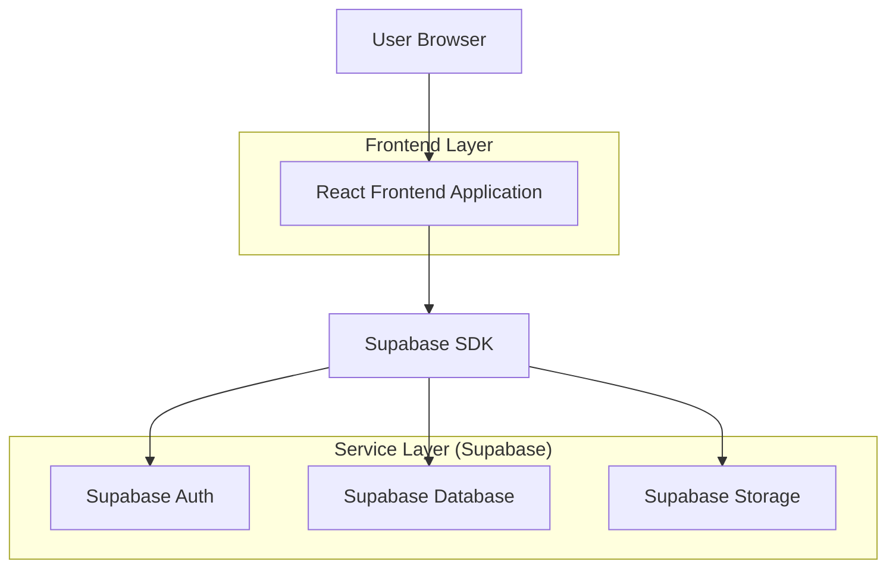
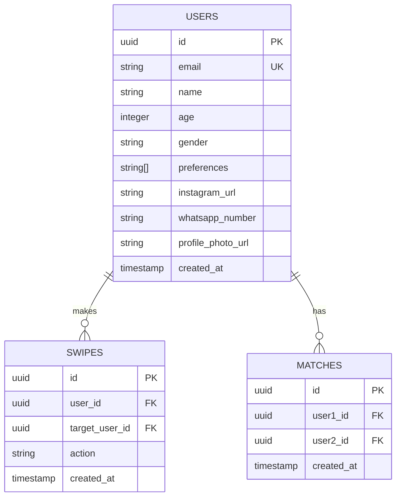

## 1. Architecture design



## 2. Technology Description
- Frontend: React@18 + tailwindcss@3 + vite
- Initialization Tool: vite-init
- Backend: Supabase (Auth + PostgreSQL + Storage)
- Mobile UI: react-native-web (opcional para mejor UX mobile)

## 3. Route definitions
| Route | Purpose |
|-------|---------|
| /register | Registro de nuevo usuario con Instagram obligatorio |
| /swipe | Interfaz principal de swipe de perfiles |
| /matches | Lista de matches con enlaces de contacto |
| /profile | Edición de perfil y preferencias |
| /login | Login de usuario existente |

## 4. API definitions

### 4.1 Core API

**User registration**
```
POST /auth/v1/signup
```

Request (via Supabase):
```json
{
  "email": "user@example.com",
  "password": "securepassword",
  "data": {
    "name": "Juan",
    "age": 25,
    "gender": "male",
    "preferences": ["female"],
    "instagram_url": "https://instagram.com/juan",
    "whatsapp_number": "+34666123456",
    "profile_photo_url": "https://storage.supabase.com/..."
  }
}
```

**Get profiles for swipe**
```
GET /rest/v1/profiles?select=*&limit=10
```

**Create like/dislike**
```
POST /rest/v1/swipes
```

Request:
```json
{
  "target_user_id": "uuid",
  "action": "like" | "dislike"
}
```

**Get matches**
```
GET /rest/v1/matches?select=*,matched_user:profiles!inner(*)
```

## 5. Server architecture diagram
No backend propio requerido - Supabase maneja toda la lógica server-side mediante:
- Row Level Security (RLS) policies
- Database triggers para detectar matches mutuos
- Storage para fotos de perfil

## 6. Data model

### 6.1 Data model definition


### 6.2 Data Definition Language

**Users table**
```sql
-- create table
CREATE TABLE users (
    id UUID PRIMARY KEY DEFAULT gen_random_uuid(),
    email VARCHAR(255) UNIQUE NOT NULL,
    name VARCHAR(100) NOT NULL,
    age INTEGER CHECK (age >= 18 AND age <= 100),
    gender VARCHAR(20) NOT NULL,
    preferences TEXT[] DEFAULT ARRAY['all'],
    instagram_url VARCHAR(255) NOT NULL,
    whatsapp_number VARCHAR(20),
    profile_photo_url VARCHAR(500),
    created_at TIMESTAMP WITH TIME ZONE DEFAULT NOW()
);

-- create indexes
CREATE INDEX idx_users_email ON users(email);
CREATE INDEX idx_users_age ON users(age);
CREATE INDEX idx_users_gender ON users(gender);

-- RLS policies
ALTER TABLE users ENABLE ROW LEVEL SECURITY;
CREATE POLICY "Public profiles are viewable by everyone" ON users FOR SELECT USING (true);
CREATE POLICY "Users can update own profile" ON users FOR UPDATE USING (auth.uid() = id);
```

**Swipes table**
```sql
CREATE TABLE swipes (
    id UUID PRIMARY KEY DEFAULT gen_random_uuid(),
    user_id UUID REFERENCES users(id) ON DELETE CASCADE,
    target_user_id UUID REFERENCES users(id) ON DELETE CASCADE,
    action VARCHAR(10) CHECK (action IN ('like', 'dislike')),
    created_at TIMESTAMP WITH TIME ZONE DEFAULT NOW(),
    UNIQUE(user_id, target_user_id)
);

-- RLS policies
ALTER TABLE swipes ENABLE ROW LEVEL SECURITY;
CREATE POLICY "Users can create own swipes" ON swipes FOR INSERT WITH CHECK (auth.uid() = user_id);
CREATE POLICY "Users can view swipes they made" ON swipes FOR SELECT USING (auth.uid() = user_id);
```

**Matches table**
```sql
CREATE TABLE matches (
    id UUID PRIMARY KEY DEFAULT gen_random_uuid(),
    user1_id UUID REFERENCES users(id) ON DELETE CASCADE,
    user2_id UUID REFERENCES users(id) ON DELETE CASCADE,
    created_at TIMESTAMP WITH TIME ZONE DEFAULT NOW(),
    UNIQUE(LEAST(user1_id, user2_id), GREATEST(user1_id, user2_id))
);

-- Trigger para crear match cuando hay like mutuo
CREATE OR REPLACE FUNCTION check_mutual_like()
RETURNS TRIGGER AS $$
BEGIN
    IF NEW.action = 'like' AND EXISTS (
        SELECT 1 FROM swipes 
        WHERE user_id = NEW.target_user_id 
        AND target_user_id = NEW.user_id 
        AND action = 'like'
    ) THEN
        INSERT INTO matches (user1_id, user2_id) 
        VALUES (LEAST(NEW.user_id, NEW.target_user_id), GREATEST(NEW.user_id, NEW.target_user_id));
    END IF;
    RETURN NEW;
END;
$$ LANGUAGE plpgsql;

CREATE TRIGGER trigger_check_mutual_like
    AFTER INSERT ON swipes
    FOR EACH ROW
    EXECUTE FUNCTION check_mutual_like();

-- RLS policies
ALTER TABLE matches ENABLE ROW LEVEL SECURITY;
CREATE POLICY "Users can view own matches" ON matches FOR SELECT USING (auth.uid() = user1_id OR auth.uid() = user2_id);
```